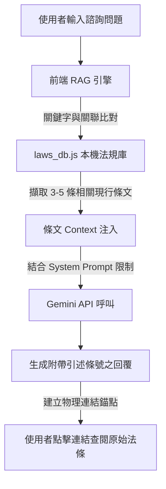

# GP-KOS: 政府採購法 AI 智慧學習與決策支援平台 ⚖️🤖
> **Government Procurement Knowledge Operating System**

本系統是專為準備**政府採購專業人員訓練考試**（是非題與選擇題）以及採購承辦人員設計的智慧學習與決策輔助平台。不同於傳統單純刷題的網站，GP-KOS 結合了**修法版本治理**、**觀念圖譜**與**前端 RAG（檢索增強生成）**技術，幫助使用者從死記硬背升級到深度理解採購法規的內在邏輯。

*   🌐 **線上展示與說明**：本專案預計部署於 GitHub Pages / Netlify。
*   📦 **題庫來源**：[政府電子採購網 - 採購法規題庫](https://web.pcc.gov.tw/psms/plrtqdm/questionPublic/indexReadQuestion)

---

## 🎯 Project Vision

傳統題庫練習往往只能讓考生重複記憶答案，卻難以建立完整的法規知識架構，更無法應對因時間推移而修訂的法規變更（例如小額採購額度從 10 萬調高至 15 萬、公告金額調至 150 萬等問題）。

**GP-KOS** 的願景是將生硬的題庫與法規轉化為一套**「政府採購知識作業系統 (GP-KOS)」**，結合：
*   **政府採購法題庫與章節講義**：結構化的自學引導。
*   **現行與歷史法規版本控制**：應對歷年修法，自動提示考題答案的時效性。
*   **前端 Legal RAG 技術**：保證 AI 諮詢與解析的 100% 條文溯源，拒絕 AI 幻覺。
*   **AI Tutor 智慧弱點教練**：自動分析學習軌跡與遺忘曲線。

我們希望協助考生、政府機關承辦人員與採購業者，建立一個可持續更新、易於檢索與記憶的採購法規知識體系。

---

## 📸 Screenshots

### 📖 Study & Tutorial Mode (分章引導與講義教學)
*學習模式可自由選擇主題與年度，並隨時切換至章節講義視窗查閱核心法條與考點陷阱。*


### 📝 Mock Exam (模擬考與修法警示)
*模擬考倒數計時交卷。遇到因修法（如112年調整限額）導致答案變更的題目，系統會亮起橘色修法警告卡片，展示新舊法對照。*


### 💬 AI Consultation & Chat (AI 法規諮詢對話)
*使用者可以直接詢問採購法問題，AI 會根據本機法規庫 RAG 檢索，引述正確法條並提供物理錨定溯源。*


---

## 🚀 Technical Highlights

### 1. Zero Backend Architecture (無後端輕量架構)
本系統採用 100% 純前端 SPA 架構，無需資料庫、伺服器或登入系統。僅憑靜態 HTML5、Vanilla CSS 與 JavaScript，即可流暢完成題庫渲染、模擬考計時、錯題本追蹤與 AI 對話。

### 2. Offline-First Capability (離線學習優先)
所有題庫 (`questions_db.js`)、講義 (`tutorial_db.js`) 與法規庫均可預下載並快取至瀏覽器。即使在完全沒有網路的環境下，模擬測驗與講義閱讀功能仍能正常運作。

### 3. Legal Knowledge Governance (法律知識治理)
導入決策知識治理（DKOS）思想：
*   **時效代謝偵測**：當法規庫變更時，後台腳本自動掃描並標記失效的考題。
*   **主張鏈結物理溯源**：AI 解答中引述的每一條法規，均能物理錨定至對應的 laws 檔案，供使用者查閱真實條文，排除 AI 幻覺。

---

## 🧠 Legal RAG Architecture (法規諮詢檢索架構)

本專案利用前端 RAG 架構在瀏覽器端對 Gemini API 進行 Context 限制，保證回答的法規精確度：



---

## 🧩 Question Data Model (題庫資料結構)

考題資料庫具備**法規時效警告與版本控制能力**，資料格式如下：

```json
{
  "id": "pcc-3001",
  "category": "財物及勞務採購作業",
  "type": "mc_question",
  "question_text": "依政府採購法規定，小額採購之金額限制為新臺幣多少元以下？",
  "options": ["5萬元", "10萬元", "15萬元", "20萬元"],
  "correct_answer": 2, 
  "explanation": "出題當時依未達公告金額採購招標辦法，小額採購為 10 萬元以下。",
  "exam_year": 109,
  "has_amendment": true,
  "historical_regulation": "出題時舊法規：小額採購金額為新臺幣 10 萬元以下。",
  "current_regulation": "現行最新法規（自112年1月1日起）：工程會調高小額採購限額為新臺幣 15 萬元以下。",
  "amendment_warning": "⚠️ 注意：本題為 109 年歷史考題，答案選 2。自 112 年起已調高至 15 萬，若以現行法規答案應選 3。"
}
```

---

## 🗺️ Roadmap (產品演進路線圖)

### 📌 v1.0 MVP - 基礎刷題與更新 (現行版本)
*   [x] 題庫一鍵自動下載更新工具 (`update_pcc_data.py`)
*   [x] Word 題庫自動解析引擎 (`parse_exams.py` 輸出 `questions_db.js`)
*   [x] 是非題/選擇題分章練習與答題立判
*   [x] 模擬考試限時倒數與計分
*   [x] 基本錯題本紀錄 (LocalStorage)
*   [x] 基礎講義教學模式與 RAG 諮詢面板

### 📌 v1.5 Learning Enhancement - 學習效率強化 (已實作)
*   [x] **雙向反查索引**：點選法規條號，一鍵反向篩選並練習相關考題
*   [x] **命題熱度分析**：統計近五年各法規出現次數與考點排行榜 (Top 30 排行榜)
*   [x] **修法警告標記**：前台渲染醒目的新舊法金額對照卡片
*   [ ] **多版本法規庫**：支援歷時多次修法的時序版本軌跡追蹤

### 📌 v2.0 AI Tutor & Memory - 智慧輔助 (部分已實作)
*   [ ] **Anki 級間隔重複系統 (SRS)**：依遺忘曲線安排錯題複習天數
*   [x] **AI 主動弱點診斷**：分析近期錯題，生成錯題法條庫並推薦針對性複習
*   [x] **申論理由自評挑戰**：以 AI 檢核與診斷使用者答題背後的法規條號與法律推理
*   [ ] **個人備考進度計步器**：可視化每日做題量與章節掌握度

---

## 🛠️ 開發與環境安裝

### 1. 複製倉庫
```bash
git clone https://github.com/etrnya/Procurement-Law-exam.git
cd Procurement-Law-exam
```

### 2. 安裝 Python 依賴（用於執行一鍵更新與解析）
```bash
pip install requests beautifulsoup4 python-docx pdfplumber
```

---

## 🔄 快速開始與一鍵更新

### 一鍵下載並解析最新題庫
系統內建全自動化抓取與更新流，您只需要在根目錄執行：
```bash
python update_pcc_data.py
```
此指令會自動：
1. 造訪公共工程委員會下載最新的 Word 題庫檔案至 `downloads/`。
2. 啟動 `parse_exams.py` 解析考題、檢測修法關鍵字。
3. 輸出為 `questions_db.js`。

完成後，直接在瀏覽器中開啟 `index.html` 即可開始練習與諮詢！

---

## 📊 RAG 本地資料庫資料來源

GP-KOS 之 RAG 本地資料庫（含法條庫、解釋函令、問答與實務判決）之所有資料皆來自官方最新發布之文件與開源技術。相關來源網址聲明如下：

1. **政府採購法令與施行細則 (法令彙編)**
   - 即時連線中華民國法務部全國法規資料庫同步更新：
     - [政府採購法 (母法) 官方連結](https://law.moj.gov.tw/LawClass/LawAll.aspx?pcode=A0030057)
     - [政府採購法施行細則 官方連結](https://law.moj.gov.tw/LawClass/LawAll.aspx?pcode=A0030062)

2. **官方訓練教材與投影片**
   - 行政院公共工程委員會政府採購專業人員訓練教材投影片：
     - [政府採購專業人員訓練教材 基礎班投影片](https://www.pcc.gov.tw/content/index?type=C&eid=9868&lang=1)
     - [政府採購專業人員訓練教材 進階班投影片](https://www.pcc.gov.tw/content/index?type=C&eid=9869&lang=1)

3. **官方考試題庫下載**
   - 行政院公共工程委員會採購專業人員測驗官方考試題庫下載頁面：
     - [政府採購專業人員測驗題庫 官方下載頁面](https://www.pcc.gov.tw/cp.aspx?n=8A0D46294D2512F2)

4. **司法判決檢索與實務對照模型 (TW Legal RAG)**
   - 本系統之司法判決檢索模組及實務比對技術，參考並引用開源項目及其模型核心架構：
     - [臺灣法律 RAG 語義檢索模型 (tw-legal-rag) GitHub 倉庫](https://github.com/aa0101181514/tw-legal-rag)

---

## ⚖️ 著作權與聲明
*   本系統所收錄之原始考題與官方公佈解答之著作權歸屬**中華民國行政院公共工程委員會**所有。
*   本專案之模擬測驗系統原始碼與 AI RAG 輔助引擎遵循 [MIT License](LICENSE) 條款開源分享。
