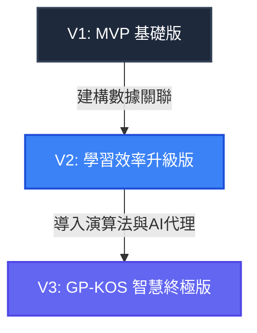

# RPD / 政府採購法模擬測驗系統需求與產品設計規格書 (Requirements & Product Document)

本文件定義「政府採購法模擬測驗系統 (Procurement-Law-exam)」之產品需求、系統功能規格與技術架構設計。

---

## 1. 專案背景與目標 (Background & Objectives)

**政府採購專業人員訓練**考試是公務人員與相關從業人員的重要證照考試。考題範圍涵蓋政府採購法及其子法，題型固定為**是非題**與**選擇題**。
政府電子採購網公開提供了 15 個主題分類的法規題庫（PDF 與 DOC 格式），但靜態檔案不便於隨身練習、隨機抽題或錯題複習。

本專案旨在打造一個**高效、響應式、免安裝且支援離線使用的單網頁測驗與練習平台 (Single Page Application, SPA)**。
考生可以透過此系統進行：
1. **分章練習**：針對政府採購網定義的 14 個專業科目（加全部題庫共 15 項）進行單題練習。
2. **隨機模擬測驗**：模擬真實考試，隨機抽取指定題數，並進行限時倒數與計分。
3. **錯題加強**：自動將答錯題目收錄至本機錯題本（LocalStorage），進行針對性複習。

---

## 2. 系統架構與技術堆疊 (System Architecture & Tech Stack)

為確保使用者體驗（Wow Factor）與極高的載入速度，系統採用 **純前端輕量化架構**：

*   **表現層 (Presentation Layer)**：
    *   `index.html` (與 `study_portal.html` 為同一核心介面)：採用語意化 HTML5。
    *   `index.css`：採用 Vanilla CSS，導入現代暗黑玻璃模砂風格（Dark Glassmorphism）與精心調配的漸層配色，確保極致的視覺美感。
    *   `app.js`：純 JavaScript (Vanilla JS) 處理測驗邏輯、狀態轉換與使用者互動。
*   **資料層 (Data Layer)**：
    *   `questions_db.js`：結構化題庫資料庫，儲存包含題號、題型（是非/選擇）、題目內容、選項、答案與分類的 JSON 陣列。
    *   `LocalStorage`：用於持久化儲存使用者的「錯題本」、「測驗歷史紀錄」與「練習進度」。
*   **基礎設施層 (Infrastructure - 數據處理)**：
    *   `parse_exams.py`：Python 題庫解析腳本，負責讀取政府採購網下載之題庫檔案並輸出為 `questions_db.js`。

---

## 3. 功能規格說明 (Functional Specifications)

### 3.1 題庫分類 (15 大分類)
系統必須支援篩選以下 15 個主題題庫：
1. 全部題庫
2. 政府採購全生命週期概論
3. 政府採購法之總則、招標及決標
4. 政府採購法之履約管理及驗收
5. 政府採購法之罰則及附則
6. 政府採購法之爭議處理
7. 底價及價格分析
8. 投標須知及招標文件製作
9. 採購契約
10. 最有利標及評選優勝廠商
11. 電子採購實務
12. 工程及技術服務採購作業
13. 財物及勞務採購作業
14. 錯誤採購態樣
15. 道德規範及違法處置

### 3.2 題型設計
*   **是非題 (True-False Question, `tf_question`)**：
    *   顯示題目文字。
    *   選項固定為 `O` (對) 與 `X` (錯)。
    *   正確答案為 `true` 或 `false`。
*   **選擇題 (Multiple-Choice Question, `mc_question`)**：
    *   顯示題目文字。
    *   顯示 4 個備選選項（通常編號為 1, 2, 3, 4）。
    *   正確答案為數字代碼（`1` ~ `4`）。

### 3.3 核心模式
1.  **分章學習模式 (Study/Practice Mode)**：
    *   使用者可選擇特定主題與題型（是非題、選擇題或混合）。
    *   單題呈現，答完立即判定正誤：
        *   若答對，顯示綠色視覺反饋與正確圖示。
        *   若答錯，顯示紅色視覺反饋，並高亮正確答案，同時**自動將該題加入「錯題本」**。
    *   提供「上一題」與「下一題」導覽。
2.  **模擬測驗模式 (Mock Exam Mode)**：
    *   可自訂或採用標準配置（例如：共 50 題，包含是非題 25 題、選擇題 25 題）。
    *   隨機從所選範圍抽取指定數量考題。
    *   設有倒數計時器（例如：50 分鐘）。
    *   交卷前不顯示答案正誤。
    *   交卷後展示得分報告（包含答對率、花費時間），並列出所有錯題及其正確解答。
3.  **錯題本模式 (Error Ledger Mode)**：
    *   獨立顯示所有答錯的題目。
    *   使用者可在錯題本中重複練習，答對後可手動或自動將該題「移出錯題本」。
3.4 法規時效與新舊法條對照機制 (Regulation Versioning & Comparative Explanations)：
    *   **背景背景與痛點**：政府採購法規（如小額採購、公告金額等門檻限制，以及招標子法）會隨時間修訂。歷史考題的「正確答案」往往是根據出題當時的舊法，但在現行新法下可能已不適用。
    *   **核心功能**：
        1.  **新舊法對照顯示**：針對涉及修法變更的題目，在解析區塊同時呈現「出題當時歷史法規」與「現行最新法規」。
        2.  **修法警告標記 (Amendment Alert)**：若該題在現行法規下的正確答案或標準已改變（例如舊法答案為 10 萬，新法已改為 15 萬），系統會在練習與解析模式中顯示醒目的「修法警告卡片」，避免考生混淆。
        3.  **AI 解題輔助提示**：AI 智慧解題引擎在生成解析時，必須優先比對最新的政府採購法規資料庫，找出法條異動，並明確指出修法年份與條文差異。
3.5 考試年份與「近五年考題」焦點篩選 (Exam Year & Past 5 Years Focus Filter)：
    *   **核心功能**：
        1.  **年度標記**：每道題目均需記錄其考試年度（例如 `109`、`110`、`111`、`112`、`113`、`114` 等）。
        2.  **近五年焦點篩選器**：系統主介面提供快捷開關或下拉選單，允許使用者「僅練習近五年考題」（例如設定當前時間為 115 年，則篩選 110 ~ 114 年之試題），幫助考生將有限的備考精力集中在最具時效性的最新題庫上。
3.6 章節引導教學模式 (Chapter Tutorial Mode)：
    *   **核心功能**：
        1.  **分章講義展示**：提供「章節教學」介面，整合各章節的法規核心重點、官方培訓教材（講義）精華。
        2.  **核心法條速查**：列出該章節最常考、最重要的採購法條文，特別標記「修法變更限額（如小額、公告金額等）」。
        3.  **即時學以致用**：在教學講義卡片底部，提供「前往練習本章考題」的快捷按鈕，形成「先讀講義、後測驗」的閉環學習。
3.7 AI 採購法規智慧諮詢模式 (AI Consultation Mode / Chat Mode)：
    *   **核心功能**：
        1.  **即時法律諮詢對話**：提供全功能的 AI 對話介面，使用者可輸入任何關於政府採購法規的疑難雜症（例如：「如何判定共同投標的資格限制？」或「112年小額採購改為15萬對限制性招標的影響？」）。
        2.  **法規條文與修法對照精確引述**：AI 需基於系統 Prompt 設定，扮演精通中華民國《政府採購法》與其施行細則的專家顧問。在回答時必須明確指出引用之法規條號（如：採購法第50條、第101條），並對涉及修法的金額（如公告金額、查核金額、小額採購）進行精準解釋。
        3.  **本機 API 金鑰設定 (API Key Control)**：使用者可點選介面設定，輸入並儲存自己的 Gemini API Key 於瀏覽器 LocalStorage。系統直接進行前端 Serverless 連線，確保私隱與資料安全。

---


## 4. UI/UX 設計規範 (Design System & Aesthetics)


為符合「豐富美學 (Rich Aesthetics)」標準，並**特別為未來手機瀏覽與操作保留空間 (Mobile-First Ready)**，介面設計應遵循以下原則：
*   **響應式與行動優先配置 (Mobile-First Responsiveness)**：
    *   **版面容器縮放**：主體卡片設計採用 `max-width: 650px` 並置中，在桌面端呈現極佳的視覺比例，在手機端則自動延伸為 `100%` 寬度。這為未來的 PWA (Progressive Web App) 或手機打包 (Capacitor/Cordova) 預留了完美的版面比例。
    *   **點擊尺寸 (Touch Targets)**：所有選項按鈕、分頁切換與功能鍵，高度均不得低於 `48px`，且彼此間保留足夠安全間距（至少 `12px`），以防在手機上誤觸。
    *   **底部固定導覽列 (Sticky Bottom Bar)**：在手機尺寸下，答題與切換按鈕會固定懸浮於畫面底部，方便單手大拇指操作。
*   **配色系統**：
    *   主背景色：深藍黑 (`#0b0f19`) 或 帶微紫調的太空灰。
    *   卡片與面板：半透明玻璃質感（`rgba(30, 41, 59, 0.7)`）配合 `backdrop-filter: blur(12px)`。
    *   邊框與分隔線：細緻的漸層發光邊框 (`border: 1px solid rgba(255, 255, 255, 0.1)`)。
    *   強烈對比點綴色：政府採購法代表色或專業的青藍色 (`#38bdf8`)，搭配動態發光（Glow Effect）。
    *   修法警告色：暖橘色漸層背景與黃色外框，以提示新舊法規差異。
*   **字體**：
    *   引進 Google Fonts (如 `Inter` 與 `Outfit` 作為英數字體，搭配系統預設高品質黑體)。
*   **微動畫 (Micro-animations)**：
    *   按鈕 hover 時微幅放大與邊框發光。
    *   答題卡切換時具有平滑橫向滑入動畫 (slide-in / fade-in)。
    *   答對與答錯時的狀態卡片具備輕微彈性縮放 (elastic bounce)。

---

## 5. 資料結構定義 (Data Models)

### `questions_db.js` 結構
```javascript
const questions_db = [
  {
    id: "pcc-1001",
    category: "政府採購法之總則、招標及決標",
    type: "tf_question", // "tf_question" 或 "mc_question"
    question_text: "機關辦理採購，其進入決標程序後，如發現廠商有不法行為，仍應強行決標。",
    options: ["O", "X"], // 是非題固定為 O/X
    correct_answer: false, // 或者是 "X"
    explanation: "依政府採購法第50條規定，投標廠商有特定不法或不當情形者，於決標前發現者不予決標。",
    has_amendment: false // 是否有因修法導致的異動
  },
  {
    id: "pcc-2001",
    category: "投標須知及招標文件製作",
    type: "mc_question",
    question_text: "機關辦理公告金額以上採購之公開招標，其自公告日至截止投標日之等標期，除符合縮短規定外，不得少於幾日？",
    options: [
      "7日",
      "14日",
      "21日",
      "28日"
    ],
    correct_answer: 2, // 選項 index 從 1 開始代表 "14日"
    explanation: "依招標期限標準規定，公告金額以上未達查核金額之採購，公開招標之等標期不得少於14日。",
    has_amendment: false,
    exam_year: 111
  },
  {
    id: "pcc-3001",
    category: "財物及勞務採購作業",
    type: "mc_question",
    question_text: "依政府採購法規定，小額採購之金額限制為新臺幣多少元以下？",
    options: [
      "5萬元",
      "10萬元",
      "15萬元",
      "20萬元"
    ],
    correct_answer: 2, // 歷史考題答案為 10 萬元 (當時法規)
    explanation: "出題當時依《中央機關未達公告金額採購招標辦法》第5條，小額採購額度為10萬元以下。",
    has_amendment: true,
    historical_regulation: "出題時適用法規：小額採購金額為新臺幣 10 萬元以下。",
    current_regulation: "現行最新法規（自112年1月1日起施行）：工程會修正提高小額採購金額為新臺幣 15 萬元以下。",
    amendment_warning: "⚠️ 注意：本題為歷史考古題，當時小額採購限額為 10 萬（答案選 2）。自 112 年起已調高至 15 萬，若以現行法規應選 3。",
    exam_year: 109
  }
];
```

### `tutorial_db.js` 結構
```javascript
const tutorial_db = {
  "政府採購全生命週期概論": {
    topic: "政府採購全生命週期概論",
    key_takeaways: [
      "採購生命週期包含：規劃招標、決標、履約管理、驗收及爭議處理五大階段。",
      "採購核心原則：公平、公開、效率與品質之合理維護。"
    ],
    core_laws: [
      {
        article: "政府採購法第 1 條",
        content: "為建立政府採購制度，依公平、公開之採購程序，提升採購效率與功能，確保採購品質，特制定本法。",
        note: "立法宗旨，注意關鍵字「公平、公開、效率、品質」。"
      }
    ],
    exam_focus: [
      "常考選擇題：下列何者非政府採購法之核心宗旨？（公平、公開、效率均是）。"
    ]
  }
};
```

---

## 6. DKOS & Legal RAG 融合架構設計 (Fusing tw-legal-rag Integration)

為實現高精確度的採購法規答疑並防範 AI 幻覺，本專案深度整合並簡化了 `tw-legal-rag` 的決策知識治理（DKOS）思想，實作「前台輕量化運行、後台自動化代謝」的架構：

### 6.1 前端 RAG 檢索流程 (Client-Side RAG)
1.  **現行法規庫部署**：將採購法母法與主要子法（共計約 20 多個招標子法條文）預先打包為 `laws_db.js`，作為本地靜態資源。
2.  **關鍵字過濾與 Context 注入**：
    *   使用者在「AI 諮詢模式」提問時，前端 JS 引擎會先對 `laws_db.js` 進行本機的語意或關鍵字檢索，鎖定與提問最相關的 3-5 條現行最新法條。
    *   將檢索出的法條條文作為真實的 `Context` 與系統 Prompt（約束只能引述所提供之法條）一同打包發送給 Gemini API。
3.  **物理溯源 (Claim Traceability)**：AI 生成的回答會帶有 `[第 X 條]` 標記，前端網頁會將其解析為錨點連結，點選即可直接彈窗查閱 `laws_db` 中的原始條文。

### 6.2 法律知識代謝流程 (Knowledge Decay Pipeline)
1.  **一鍵下載與掃描**：執行 `update_pcc_data.py` 時，除下載最新 Word 檔外，後台腳本會自動加載最新版法規庫 `laws_db`。
2.  **異動衝突判定 (Decay Check)**：
    *   腳本將舊考題中涉及的金額、限額等門檻文字與新版 `laws_db` 比對。
    *   若考題答案與現行法規標準（如現行小額 15 萬 vs 舊法 10 萬）產生衝突，自動判定該題之法律知識前提已「失效 (Decayed)」。
    *   自動將該題的 `has_amendment` 欄位設為 `true`，並將異動詳情與修法年份寫入 `amendment_warning`、`historical_regulation` 與 `current_regulation`，最終匯出至 `questions_db.js`。

---

## 7. GP-KOS (政府採購知識作業系統) 升級規劃與演進路線 (Upgrade Path to GP-KOS)

為了突破傳統題庫網站「僅能做題與看簡答」的限制，本平台在架構上預留了向 **GP-KOS (Government Procurement Knowledge Operating System)** 演進的升級空間。以下為解決各關鍵盲點的架構與資料結構設計：

### 7.1 升級模組規格與資料結構

#### 1. 觀念地圖模組 (Concept Map)
*   **目的**：引導考生建立結構化法規思維，不只死記單題答案，而是理解法條關聯。
*   **資料結構設計 (`concept_db.js`)**：
    ```javascript
    const concept_db = {
      "GPA-050": {
        concept_id: "GPA-050",
        title: "不予決標與撤銷決標",
        article: "政府採購法第 50 條",
        related_articles: ["第 31 條", "第 48 條", "第 101 條"],
        common_traps: ["押標金不予發還之判定", "廢標與不予決標之區別", "停權處分之連動"],
        summary: "說明招標、投標、決標程序中，廠商有不法或不當行為時，機關應採取之不予決標、撤銷決標、解除契約或終止契約之處置。"
      }
    };
    ```
*   **回饋機制**：當使用者答錯某一考題時，除了顯示答案，系統會自動比對該題對應之 `concept_id`，彈窗呈現該觀念的「相關條文對照表」與「常見考點 trap」對比卡片。

#### 2. 命題分析引擎 (Exam Analytics Engine)
*   **目的**：利用近五年（110~114年）考題的年度大數據，為考生提供高頻命題法條排行榜，指出準備的重中之重。
*   **運作流程**：後台腳本自動加載 `questions_db.js`，統計每個 `correct_answer` / `explanation` 中提及之法條出現頻率，動態產生高頻熱度表。
*   **前端呈現**：主畫面新增「🔥 近五年高頻考點 Top 10」排行榜（例如：第 50 條出現 28 次、第 101 條出現 25 次），點擊即可一鍵過濾出與該高頻法條相關的所有題庫進行突擊練習。

#### 3. 間隔重複系統錯題本 (Spaced Repetition System - SRS)
*   **目的**：取代靜態錯題本，導入 Anki/SuperMemo 遺忘曲線演算法，提高複習效率。
*   **資料結構設計 (LocalStorage `srs_ledger`)**：
    ```javascript
    const srs_ledger = {
      "pcc-1001": {
        id: "pcc-1001",
        ease_factor: 2.5,       // 難易度係數 (預設 2.5)
        next_review: "2026-06-14T18:00:00.000Z", // 下次應複習時間
        review_count: 1,        // 已複習次數
        interval_days: 1        // 複習間隔天數 (1 ➜ 3 ➜ 7 ➜ 14 ➜ 30)
      }
    };
    ```
*   **排程邏輯**：答錯時 `interval_days` 歸 1，下次複習設為 1 天後；答對時依 `ease_factor` 乘以目前間隔天數，推遲下次複習時間，最大可推遲至 30 天。

#### 4. AI Tutor 智慧弱點診斷
*   **目的**：讓 AI 扮演主動輔導老師，而非被動 ChatBot。
*   **診斷機制**：前端收集使用者最近 50 次答錯的考題分類與法條。若發現使用者在「政府採購法第 22 條」、「招標與決標」主題的答錯率高於 40%，AI 在諮詢模式中會主動推送：「偵測到您對『廠商資格審查與限制性招標』的概念較為薄弱，建議閱讀第 22 條講義卡片，或挑戰對應模擬考題。」

#### 5. 法規多版本庫 (Regulation Version Store)
*   **目的**：防止因法規多次修改（例如 109年、112年、115年）導致單純「新舊對照」資料結構爆掉。
*   **資料結構設計**：
    ```javascript
    const regulation_version_store = {
      "GPA-Art-050": {
        article_no: "50",
        versions: [
          { year: 109, content: "機關辦理採購...（舊版金額與限制）" },
          { year: 112, content: "機關辦理採購...（調整限制與金額）" },
          { year: 115, content: "機關辦理採購...（現行最新修正條文）" }
        ]
      }
    };
    ```

#### 6. 雙向反查索引 (Bidirectional Indexing)
*   **目的**：支援「從題目查法條，從法條查題目」的雙向導航。
*   **實作方法**：前端主動建立索引表。在「AI 諮詢模式」或「講義教學模式」中，點擊任何法規條號（如第 50 條），可立馬顯示「該條文近年共出過 38 題」，點擊後即可一鍵載入該 38 題開始刷題練習。

---

### 7.2 產品演進路線圖 (GP-KOS Roadmap)



*   **V1 (現行 MVP 階段) - 已實作**
    *   是非題與選擇題分章練習。
    *   基本模擬考試計時計分。
    *   本機 LocalStorage 靜態錯題本。
    *   本機 RAG 與 Gemini API 對話的被動式 AI 法律諮詢。
    *   Python 一鍵爬網下載與解析資料庫腳本。
*   **V2 (學習效率升級階段) - 規劃中**
    *   **雙向反查**：法條與考題一鍵雙向連動刷題。
    *   **命題分析**：近五年考題高頻命題法條 Top 排行榜與熱度分析。
    *   **法規多版本庫**：支援歷次修法（109年、112年、115年）條文時序追蹤。
    *   **觀念地圖**：整合「GPA-050」等核心概念卡片與陷阱對比。
*   **V3 (GP-KOS 智慧終極階段) - 規劃中**
    *   **SRS 間隔重複**：仿 Anki 遺忘曲線複習排程。
    *   **AI Tutor 弱點診斷**：主動分析錯題盲區並推薦學習與出題計畫。
    *   **個人化讀書計步器**：追蹤每日備考進度與考點掌握度曲線。


